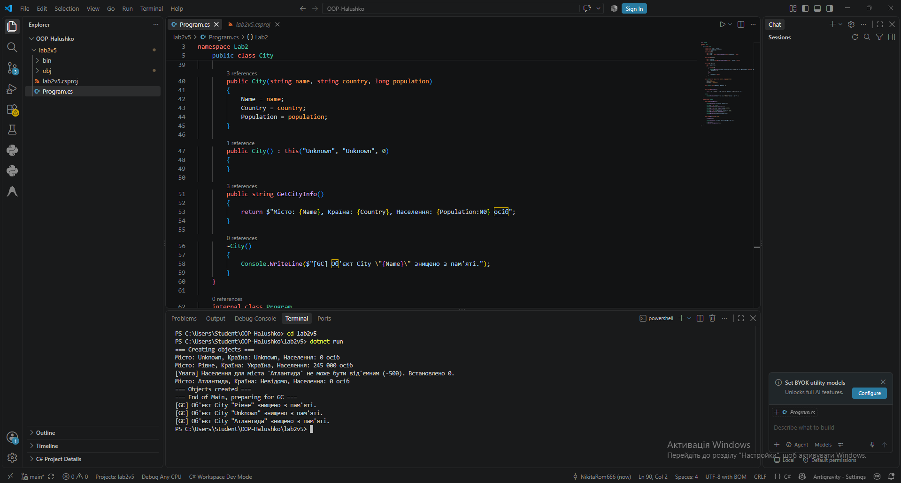

# Лабораторна робота №2 (Варіант 5 — City)

**Тема:** Клас із кількома конструкторами. Життєвий цикл об’єкта.  
  
**Мета:** Навчитися реалізовувати перевантажені конструктори, дослідити порядок їх викликів та зрозуміти основи життєвого циклу об’єкта в C#.

---

## Хід роботи

### Результат виконання програми

1. **Створення та розширення класу `City`:**  
   У проєкті `lab2v5` розширено клас `City` шляхом додавання кількох перевантажених конструкторів (за замовчуванням, з параметрами та конструктора, що викликає інший через `: this()`).

2. **Дослідження життєвого циклу:**  
   Додано виводи в консоль у конструкторах для відстеження порядку ініціалізації об'єктів під час їх створення в пам'яті.

3. **Тестування перевантажених конструкторів:**  
   У файлі `Program.cs` створено кілька екземплярів класу `City` за допомогою різних конструкторів та перевірено коректність їхньої роботи.

---

## Контрольні запитання

1. **Що таке перевантаження конструкторів і навіщо воно використовується?**  
   Це створення кількох конструкторів у одному класі з однаковим ім'ям, але різним набором параметрів. Це дозволяє гнучко ініціалізувати об'єкти з різною кількістю початкових даних.

2. **Що таке ключове слово `this` під час виклику конструктора?**  
   Ключове слово `this(...)` використовується для перенаправлення (делегування) виклику з одного конструктора до іншого в межах того ж класу, що дозволяє уникнути дублювання коду ініціалізації.

3. **Як працює життєвий цикл об'єкта в C# та яку роль відіграє Garbage Collector (GC)?**  
   Життєвий цикл починається зі створення об'єкта у купі (Heap) за допомогою оператора `new` та виклику конструктора. Об'єкт існує, поки на нього є посилання. Коли посилання зникають, Garbage Collector автоматично звільняє пам'ять, виділену під цей об'єкт.
