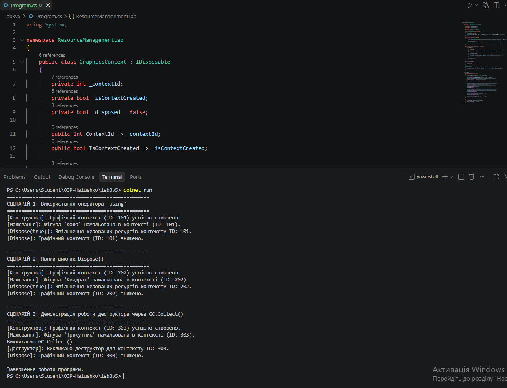

# Лабораторна робота №3 (Варіант 5 — GraphicsContext)

**Тема:** Життєвий цикл об'єкта та керування ресурсами.
**Мета:** Поглибити розуміння життєвого циклу об'єкта в С#, навчитися працювати з некерованими ресурсами, реалізувати інтерфейс IDisposable та патерн Dispose.

---

## Хід роботи

1. Створено консольний проєкт `lab3v5`.
2. Реалізовано клас `GraphicsContext`, який реалізує інтерфейс `IDisposable` та патерн `Dispose`.
3. У методі `Main` продемонстровано три сценарії використання ресурсу:
   - Автоматичне звільнення через оператор `using`.
   - Явний виклик `Dispose()`.
   - Демонстрація роботи деструктора (фіналізатора) через `GC.Collect()`.

---

## Результат виконання програми

