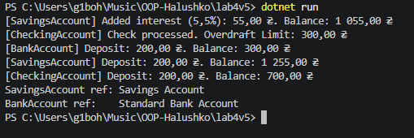

# Лабораторна робота №4 (Варіант 5 — BankAccount)

**Тема:** Наслідування. Ключові слова base, override, virtual. Приховування членів (new).

**Мета:** Навчитися створювати ієрархії класів, використовувати ключові слова base, virtual, override для реалізації поліморфізму, а також розуміти відмінності між override та приховуванням членів за допомогою new.

---

## Хід роботи

1. Створено консольний проєкт `lab4v5`.
2. Реалізовано ієрархію класів:
   * Базовий клас `BankAccount` з приватними/захищеними полями, властивостями, конструктором та віртуальним методом `Deposit()`.
   * Похідні класи `SavingsAccount` та `CheckingAccount`, які викликають конструктор базового класу через `base`, перевизначають метод `Deposit()` через `override` та мають унікальні методи (`AddInterest()`, `ProcessCheck()`).
   * У класі `SavingsAccount` реалізовано приховування методу `GetAccountType()` за допомогою модифікатора `new`.
3. У методі `Main` продемонстровано:
   * Виклик унікальних методів похідних класів.
   * Поліморфну поведінку перевизначеного методу `Deposit()` через масив базового типу `BankAccount[]`.
   * Різницю між `override` та `new` при виклику методів через посилання різних типів (`SavingsAccount` та `BankAccount`).

---

## Результат виконання програми

---

## Відповіді на контрольні запитання

1. **Принцип наслідування:** Дозволяє створити новий (похідний) клас на основі існуючого (базового), успадковуючи його функціональність та розширюючи або змінюючи її. *Приклад:* Клас `Vehicle` (автомобіль, мотоцикл) успадковує загальні властивості типу `Brand` чи `Speed`.
2. **Ключове слово `base`:** Використовується для доступу до членів базового класу з похідного, а саме для виклику його конструктора (`: base(...)`) або успадкованих методів (`base.Method()`).
3. **Різниця між `virtual` та `override`:** `virtual` дає дозвіл на перевизначення методу в базовому класі, а `override` надає його нову реалізацію в похідному. Разом вони забезпечують поліморфізм (динамічне/пізнє зв'язування).
4. **Модифікатор `new`:** Використовується для явного приховування члена базового класу без його перевизначення. Метод обирається за типом посилання (статичне/раннє зв'язування), а не за реальним типом об'єкта.